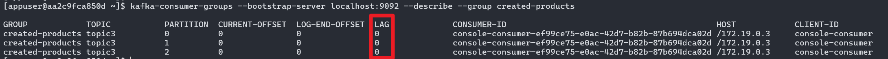
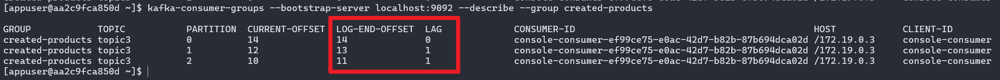
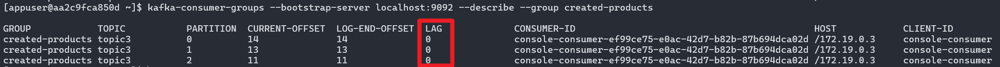
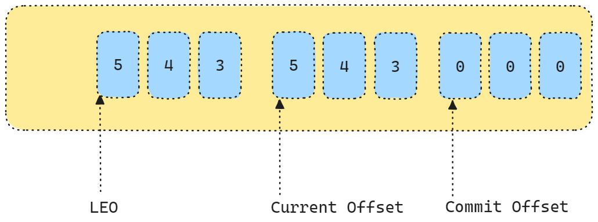

토픽생성

```bash
$ kafka-topics --create --topic topic3 --bootstrap-server kafka:9092 --partitions 3 --replication-factor 1
```


토픽 Listen (컨슈머 그룹명 : created-products)

```bash
$ kafka-console-consumer --bootstrap-server localhost:9092 --topic topic3 --group created-products
```


컨슈머 그룹 리스트 확인 (새로운 터미널 창에서)

```bash
$ kafka-consumer-groups --bootstrap-server localhost:9092 --list
created-products
```


컨슈머들 상태 확인 (`--describe`)

```bash
$ kafka-consumer-groups --bootstrap-server localhost:9092 --describe --group created-products
GROUP            TOPIC           PARTITION  CURRENT-OFFSET  LOG-END-OFFSET  LAG             CONSUMER-ID
... 결과값은 캡처로 대체함 (가독성이 떨어져서)
```



<br/>


콘솔 프로듀서 구동

```bash
$ kafka-console-producer --bootstrap-server localhost:9092 --producer-property partitioner.class=org.apache.kafka.clients.producer.RoundRobinPartitioner --topic topic3
```

<br/>


데이터 입력

```bash
>10
>11
>12
>13
>1111
>111111
>11111
>1
>1
>1
>1
>1
>1
>1
>
>1
>1
>
>1
>1
>1
>1
>1
>1
>1
>1
>
>1
>1
>
```


LAG 이 늘어나는 상황 확인해보기<br/>

- partition 은 3개인데 consumer 는 1개 구동 중인 상황
- 프로듀서에서 넣어주는 데이터의 양이 컨슈머에서 읽어들이는 데이터의 양보다 많을 경우 LAG 값이 커지는 현상 확인


```bash
$ kafka-consumer-groups --bootstrap-server localhost:9092 --describe --group created-products
```

<br/>


데이터의 소비를 모두 하지 못한 상황에서는 LAG 항목에 1 이상의 값이 나타나게 됩니다.



<br/>


컨슈머가 데이터를 모두 소모하고 나면 LAG 은 다시 0 으로 돌아옵니다.



<br/>


## Offset




- Log-End-Offset (LEO) : Partition 데이터의 끝을 의미합니다. (생성되는 데이터의 가장 최신데이터)
- Current Offset : Consumer 가 어디까지 메시지를 읽었는지를 의미합니다.
- Commit Offset : Consumer 가 어디까지 커밋을 했는지를 의미합니다. Consumer 에서 offset 을 처리했다는 Offset Commit 을 요청하면 업데이트 됩니다.


LAG 란?

- LEO 와 Current Offset 의 차이를 의미합니다.
- LAG 값이 0 보다 크다는 것은 그 만큼 컨슈머가 처리를 못했다는 의미입니다.


