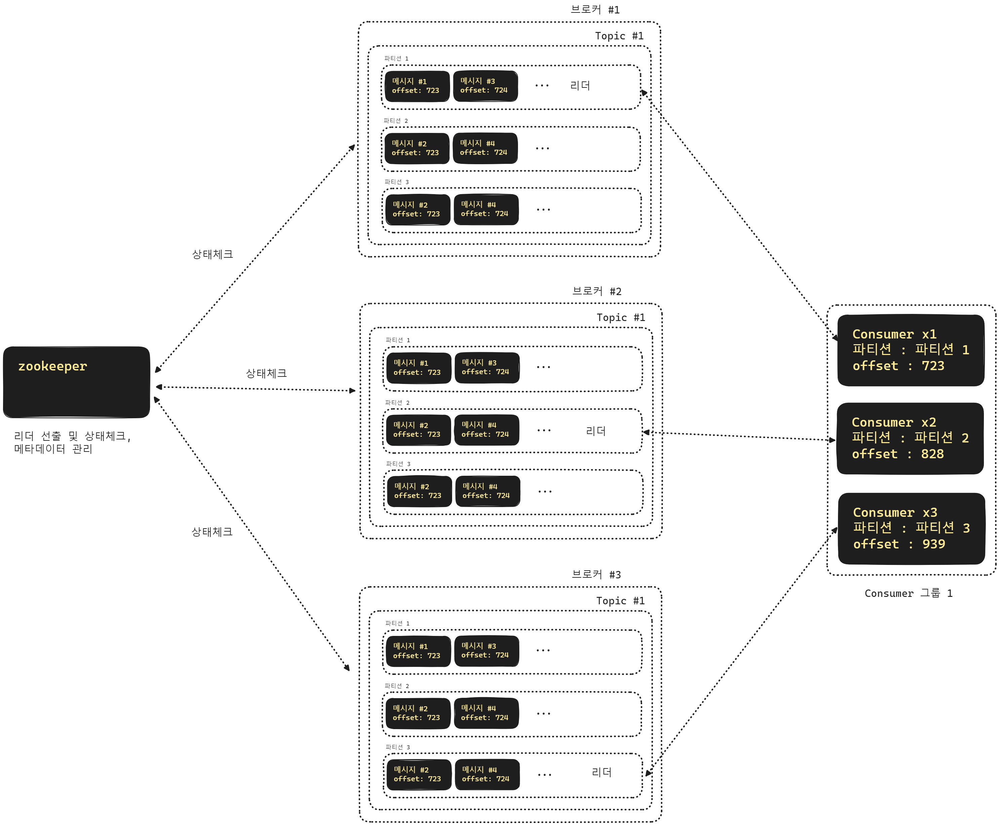
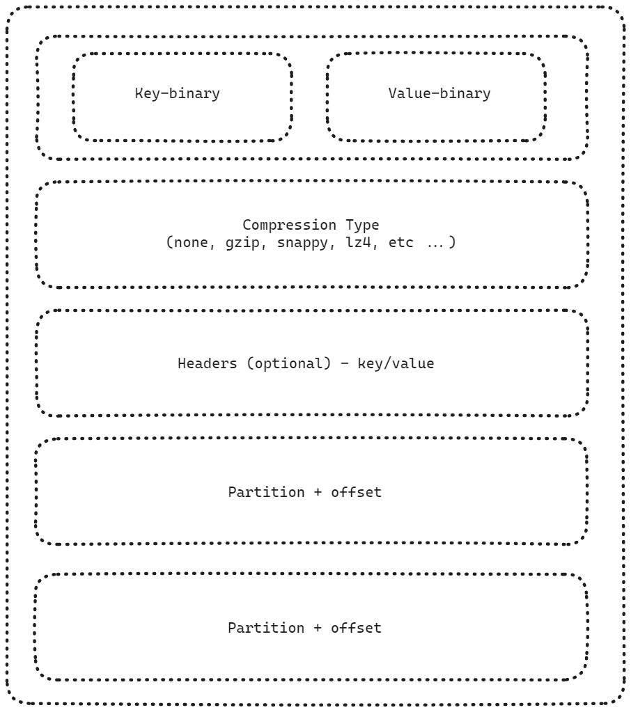
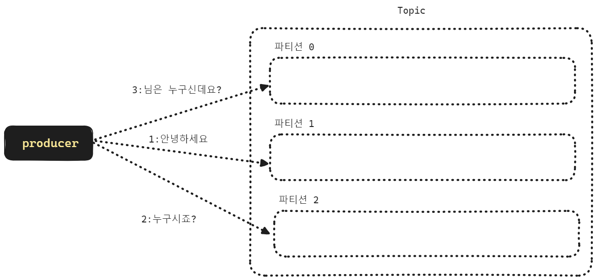
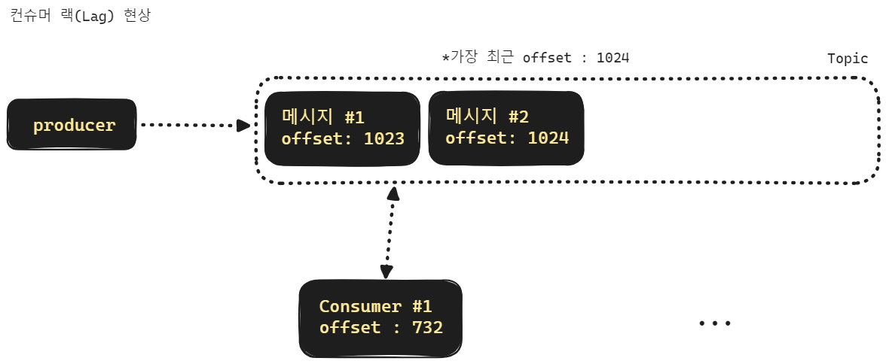
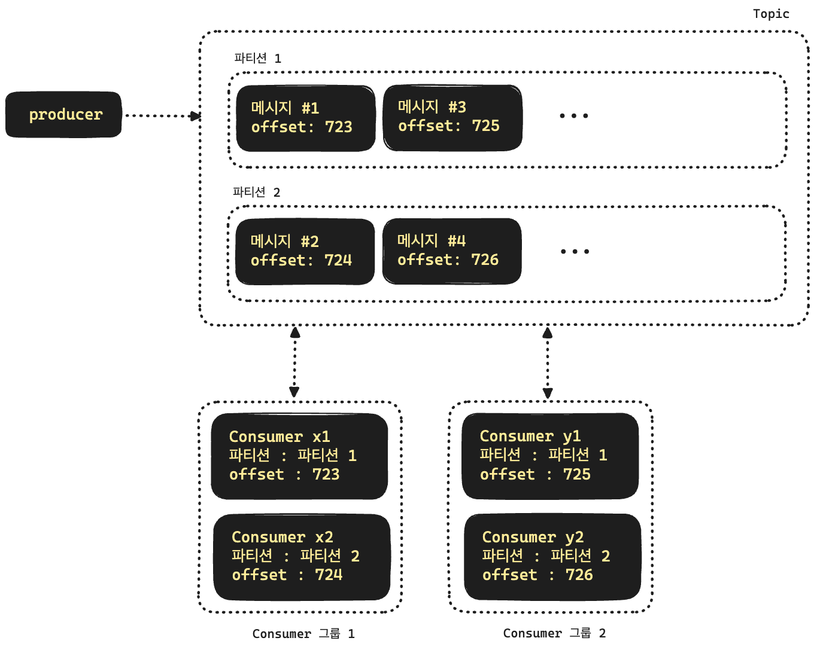
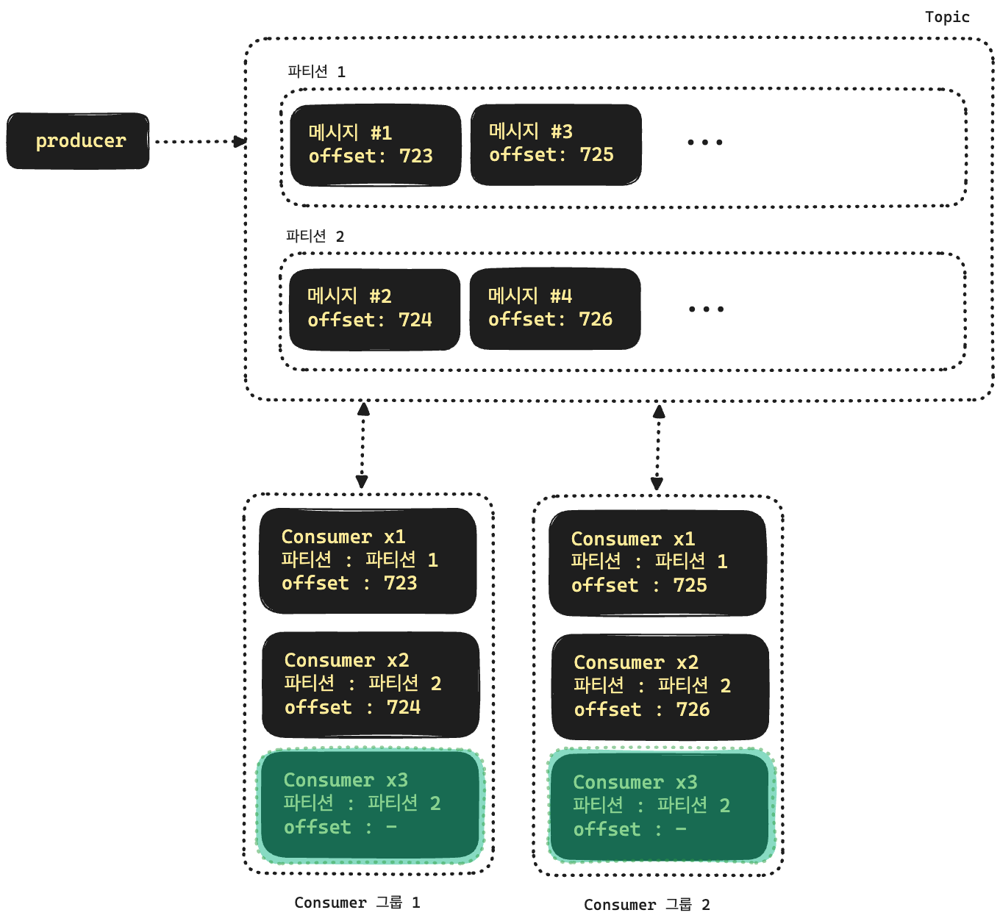
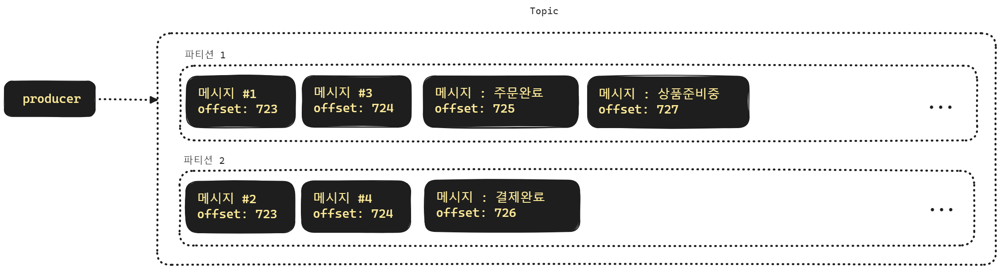
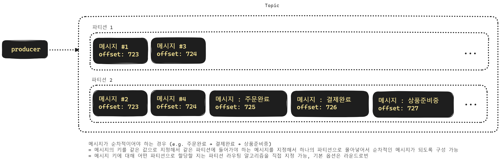
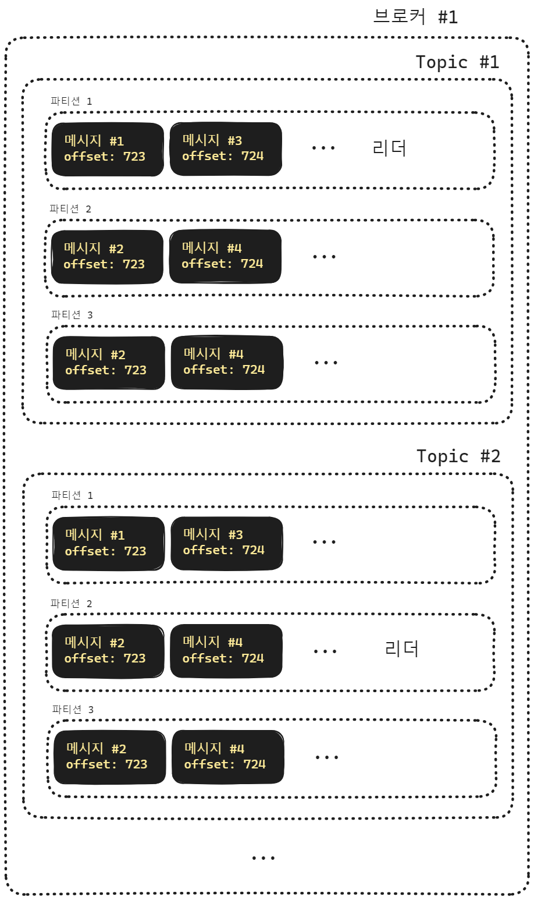
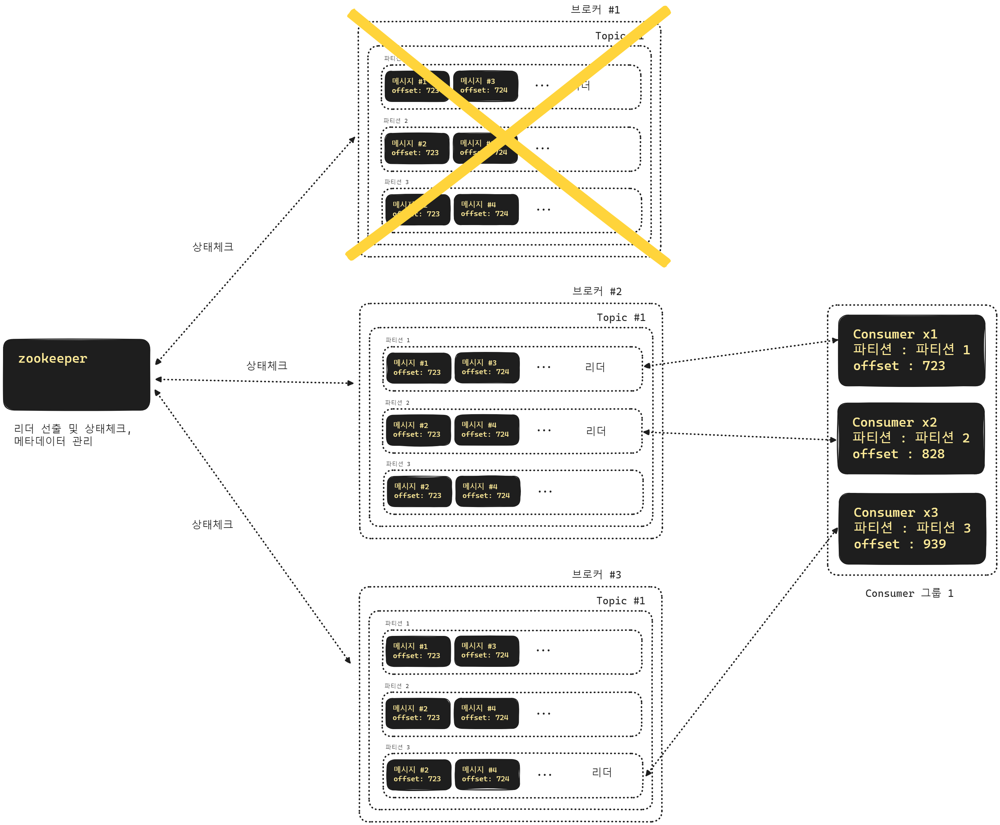

## kafka 의 주요 개념들

 

> 출처 : https://www.educba.com/kafka-replication-factor/

 

> 출처 : https://medium.com/@_amanarora/replication-in-kafka-58b39e91b64e

 

## Kafka 의 주요 특징

RabbitMQ, ActiveMQ 는 흔히 메시지 큐 인프라라고 부릅니다. 카프카의 경우에는 데이터 플랫폼이라고 부릅니다. RabbitMQ, ActiveMQ 의 경우 push model 을 채택하고 있지만, 카프카는 Publish/Subscribe 모델을 채택하고 있습니다. 

분산시스템

- 여러 브로커로 분산된 분산 시스템입니다.

Throughput (처리량)

- 실시간처리를 가능하게 해주며, 토픽을 여러 파티션으로 나눠서 처리할 수 있기 때문에 트래픽이 적은 시점에는 적은 수의 컨슈머로 트래픽을 처리하고 트래픽이 많아지면 컨슈머의 수를 늘려서 데이터를 처리할 수 있도록 유연함을 제공합니다.

Scalability (영속성)

- 수신한 데이터를 디스크에 저장합니다. 따라서 임의의 시점에 데이터를 읽을 수 있습니다.

Reliability (신뢰성)

- 메시지 전달을 보증하는 방식으로 통신을 합니다.

- 예를 들어서 Producer Acknowledgement 를 1 로 설정하면 Leader Replica 에 데이터가 전달 되었는지를 확인 후에 Ack 를 반환하는 경우를 예로 들 수 있습니다.

High Availability (고가용성)

- 여러 노드 들로 분산된 처리를 하며, 리더 브로커가 유실되더라도 나머지 브로커 중 하나가 리더 브로커 역할을 할 수 있습니다. 이 때 팔로워 브로커 들에 데이터가 복제가 이뤄지고 있도록 하는 메커니즘이 되어 있기 때문에 여러 노드에 걸쳐서 접근 가능함(Availability) 를 제공할 수 있게 됩니다.

 

## Message Format

Kafka 의 Message Format 입니다. 가장 기본적인 방식은 Key, Value 를 binary type 으로 직렬화/역직렬화 하는 방식입니다. 

조금 더 복잡한 방식으로 진화하거나 서비스의 변경사항이 유연하게 반영되도록 할 경우에는 String, int, Avro, Protobuf 등과 같은 다양한 방식으로 데이터를 직렬화/역직렬화 합니다. 

Avro 는 Schema Registry 가 운영되어야 사용 가능한 방식이며, 데이터의 변경사항에 조금 더 유연한 방식이지만 데이터 형식으로 시간타입등이 정수형으로 사용되어야 한다던가 하는 불편함이 있습니다. 카프카를 카프카 커넥트, 카프카 스트림즈 등 다양한 방식으로 사용하는 회사에서 사용되는 데이터 포맷 방식입니다.

- [Kafka Connect Avro Converter 카프카 스트림즈 예제 2](https://velog.io/@suhongkim98/Kafka-Connect-Avro-Converter-%EC%A0%81%EC%9A%A9%ED%95%98%EB%A9%B0-%EC%8A%A4%ED%82%A4%EB%A7%88-%EB%A0%88%EC%A7%80%EC%8A%A4%ED%8A%B8%EB%A6%AC-%EC%97%B0%EA%B2%B0%ED%95%98%EA%B3%A0-%EC%9D%B4%EB%A5%BC-%EC%B9%B4%ED%94%84%EC%B9%B4-%EC%8A%A4%ED%8A%B8%EB%A6%BC%EC%A6%88%EB%A1%9C-%EB%B0%9B%EC%95%84-%EC%B2%98%EB%A6%AC%ED%95%B4%EB%B3%B4%EA%B8%B0-2)
- [avro-kotlin/avro4k](https://github.com/avro-kotlin/avro4k)

 

## 컨슈머 측면 : Pull Model vs Push Model

### Pull Model

카프카의 컨슈머는 topic 으로부터 데이터를 읽어들입니다. 브로커가 데이터를 Push 한 것을 받아들이는 방식이 아닙니다. 컨슈머가 장애 발생 또는 유지보수를 위해 정지했을 경우 브로커에게 미치는 영향이 적다는 것이 pull model 의 장점입니다. 

### Push Model

RabbitMQ 와 같은 메시지 큐 시스템에서 사용되는 컨슈머 애플리케이션의 경우 Push Model 방식의 컨슈머입니다. 단건 데이터의 속도가 빠를 경우 여기에 대해 동시성 처리를 잘 해줘야 한다는 어려움이 존재합니다. 

 

## 토픽

메시지를 적재하거나 구독할 수 있는 하나의 메시지 대기열 입니다. 데이터를 읽었던 위치는 `__consumer_offset` 이라고 하는 카프카 내부의 토픽에 저장됩니다. 카프카는 데이터를 영속화 할 수 있습니다.

토픽은 파티션 1개로만 운영할 수도 있고 여러개의 파티션으로 나누어 운영할 수 도 있습니다.  

파티션을 1개로 구성할 경우 컨슈머 랙 증상이 발생할 수 있기 때문에 파티션을 여러개로 구성해서 사용하는 경우가 많습니다. 

일반적으로는 토픽 하나에 파티션을 여러 개 두어서 컨슈머 랙 증상을 방지하는 편입니다. 

## 파티션

파티션은 토픽을 여러개로 나누었을 때 나누어진 개별 영역을 파티션이라고 합니다. 

파티션은 프로듀서가 보내는 메시지의 메시지 키 값에 의해 파티션이 선택됩니다. 이 메시지 키 값을 지정하지 않고 메시지를 전송할 경우 내부적으로 라운드 로빈 방식으로 파티션을 선택해서 데이터를 전송하게 됩니다. 

- Key 가 존재할 경우 : 키를 Hash 값으로 변환 후 특정 파티션을 선택. 항상 같은 파티션이 선택 됨
- Key 를 지정하지 않으면 : Round Robin 방식으로 파티션을 선택

위의 그림은 메시지의 KEY:VALUE 가 아래와 같이 구성되었을 때 어떻게 파티션이 나타내는지를 표현한 그림입니다.

- 1:안녕하세요
  - KEY 가 1일 때는 3으로 나눈 나머지가 1이기에 파티션 1번으로 분배
- 2:누구시죠?
  - KEY 가 2일 때는 3으로 나눈 나머지가 2이기에 파티션 2번으로 분배
- 3: 님은 누구신데요?
  - KEY 가 3일 때는 3으로 나눈 나머지가 0이기에 파티션 0번으로 분배

 

### Leader Partition

> TODO : 헐 이것도 빠뜨렸었네. 정리 예정

## 메시지, 프로듀서

**메시지** 

토픽에 적재되는 개별 데이터를 메시지라고 합니다. 메시지는 key, value, timestamp 로 구성됩니다.  

**프로듀서** 

토픽에 데이터를 적재하는 역할을 합니다. 

프로듀서는 여러가지 언어로 작성 가능합니다. 

 

### Producer Acknowledgement (ACK)

> TODO: 이거 빠뜨렸었네 헐...

 

## 컨슈머, 컨슈머 랙 (LAG), 컨슈머 그룹, 컨슈머 오프셋

### 컨슈머

컨슈머는 토픽을 구독해서 메시지를 읽어들이는 역할을 수행합니다. 보통 컨슈머의 개수는 파티션의 개수에 맞춰서 띄웁니다. 

### 컨슈머 랙 

컨슈머는 토픽을 구독해서 메시지를 읽어들입니다.  그런데 프로듀서가 메시지를 발행하는 속도에 비해 컨슈머가 메시지를 읽어서 처리하는 속도가 느릴 경우 점점 컨슈머의 오프셋이 가장 최신 오프셋으로부터 멀어지게 됩니다. 이렇게 컨슈머의 읽기 속도가 메시지 발급속도를 따라가지 못하는 현상을 **"컨슈머 랙(Consumer Lag)"** 이라고 부릅니다. 

> TODO : Current Offset 과 LEO 와의 간극을 터미널 cli 로 보여주는 캡처 추가

컨슈머 랙 증상은 토픽을 여러 개의 파티션으로 구성하고 각각의 파티션을 구독하는 컨슈머들을 파티션 갯수만큼 띄우는 것으로 해결이 가능합니다.

> TODO 그림 수정 필요

 

### 컨슈머 그룹

보통 토픽을 파티션 1개로만 운영하는 경우가 없기때문에 여러개의 파티션으로 구성하는데, 이렇게 파티션을 여러개로 나누어 둔 경우 컨슈머 역시 파티션 갯수에 맞춰서 띄웁니다. 그리고 띄운 컨슈머들을 하나의 그룹으로 묶어서 하나의 그룹으로 인식하는데 이것을 컨슈머 그룹이라고 합니다.. 

만약 토픽 하나에 대한 파티션 개수보다 컨슈머 그룹내의 컨슈머 개수가 더 많다면 어떻게 될까요? 이런 경우 놀고 있는(유휴(Idle)) 상태의 컨슈머가 생기게 됩니다. 장애로 이어지지는 않지만 자원 낭비가 생기게 됩니다. 

> TODO : 헐 그림 잘못 그렸었네... 파티션에 offset 을 똑같은 번호로 지정을... 복붙의 폐해다!!!

여러 개의 파티션으로 나눌 경우 각 파티션을 바라봐야 할 컨슈머 개수도 파티션의 개수에 맞춰서 운영합니다. 그런데 파티션의 개수보다 컨슈머의 수가 더 많을 경우 일부 컨슈머는 파티션을 할당받지 못하고 대기 상태가 됩니다. 위의 그림에서는 초록색 배경으로 표시한 컨슈머가 유휴상태에 진입했습니다. 

### 컨슈머 오프셋 (Consumer Offset)

#### \_\_consumer\_offset

Kafka 는 Consumer Group 이 어떤 파티션의 어느 offset 까지 읽었는지 offset 정보를 저장합니다. offset 정보는 `__consumer_offset` 이라는 topic 에 저장됩니다. Offset 이 커밋되는 방식은 아래와 같이 3종류이며 실무에서 많이 사용되는 방식은 `At least once` 입니다. 

### 컨슈머 오프셋 (Consumer Offset) 커밋 방식들

#### At Least Once

- 실무에서 가장 많이 쓰는 방식입니다.
- 적어도 1회는 전달되며 메시지는 중복될 수는 있어도 상실되지는 않습니다.
- 재전송시도를 하며, 중복된 데이터를 삭제 하지 않습니다.
- Idempotent (멱등성) 해야 합니다. (중복된 메시지를 처리하는 것이 시스템에 영향을 미치지 않아야 합니다.)

#### At Most Once

- 1 회는 전달을 시도해보는 방식입니다.
- 메시지는 중복되지 않지만 상실될 수 있습니다.
- 재전송 시도를 안하고, 중복역시 삭제하지 않습니다.
- 예를 들면 미디어 스트리밍 처럼 실시간 중계를 할 경우에 선택할 수 있는 방식입니다.

#### Exactly Once

- 메시지를 정확히 1회만 전달합니다.
- 모든 파티션에 복제를 해야 하기에 성능은 좋지 않습니다.

 

이래 저래 검색을 해본 결과 현업에서는 데이터 복제 시의 장애가 날 것이라는 가정 없이 내부적으로 복제를 할 것이라는 전제 하에 `At Least Once` 를 선택한다고 합니다. 어차피 리더 파티션이 데이터를 받았다면, 그 이후의 복제 실패 상황에 대해 다른 파티션으로의 복제작업을 재개하는 작업 등은 L4 레벨에서의 메커니즘으로 간주하는 듯 보입니다. 

추측을 해보면, 대부분의 경우 애플리케이션 레벨에서 특정 키값이 있는지 없는지 체크하는 로직을 정의해두는 것으로 보입니다. 

## 순서가 중요한 메시지일 경우

### 1) 인프라 레벨에서 해결하는 방식

순차적인 메시지 처리를 하게끔 해야 하는 경우가 있습니다. 이런 경우 어떻게 하면 문제를 해결할 수 있는지를 정리해봅니다.

토픽을 여러 개의 파티션으로 파티셔닝하면 메시지가 순차적으로 처리는 것을 보장하지 못하게 됩니다.  

예를 들어서 **주문완료 → 결제완료 → 상품준비중** 의 순서로 메시지를 보내야 하는 경우가 있습니다. 

만약 파티션 알고리즘에 따라 처리하거나, 기본 설정인 라운드 로빈 방식으로 처리할 경우 주문완료 메시지는 파티션 1에, 결제완료는 파티션 2에, 상품 준비중 이벤트는 파티션1에 쌓이게 되어서 메시지가 순차적으로 전달되지 않을 수 있습니다. 

이런 경우 특정 상품을 장바구니에서 주문/결제 하는 기능에 대해서는 특정 파티션을 선택해서 메시지를 전송하게끔 하는 것으로 이런 문제를 해결 가능합니다. 

 

### 2\)  애플리케이션 레벨에서 해결하는 방식 (중요)

> 제가 생각하기엔 이 방식이 맞는 것 같아서요!! 하하!! 

메시지의 키값을 시간 순으로 정렬 할 수 있는 키값으로 지정해서 카프카에 전송하는 방식입니다. 메시지의 키값을 시간순으로 정렬할 수 있도록 구성했기 때문에 DB 등에서 다시 불러올 때는 가장 오래된 메시지부터 읽어들일 수 있습니다. 

- 참고 : [아파치 카프카 애플리케이션 프로그래밍 with 자바](https://ebook-product.kyobobook.co.kr/dig/epd/ebook/E000002955323)

이렇게 하면 컨슈머측에서 데이터를 읽어들일때 느려질 것이라고 추측하는 분들도 계실 수 있습니다. 하지만, 카프카의 컨슈머는 위에서 설명했듯 pull model 을 채택하고 있습니다. 컨슈머에 부하가 걸리는 일은 없고 다만 LAG 이 발생할 수 있다는 점만 존재합니다. 

LAG 이 발생하는 경우에 대한 문제점은 파티션의 범위를 크게 잡아서 컨슈머를 더 늘릴 수 있도록 구성하는 것으로 해결하고, 트래픽이 적을때는 컨슈머를 줄이는 것으로 해결이 가능합니다. 

 

## 카프카 브로커

카프카 브로커는 토픽들과 파티션들을 가지고 운영하고 있는 하나의 물리적인 서버를 의미합니다. 

> 어쩌다 보니 그림이 너무 크게 추출되었는데 그림 사이즈 수정하는 도구를 찾아서 문제를 해결하겠습니다!!! 

 

## 카프카 브로커 클러스터링

몽고DB의 레플리카셋, 샤드 클러스터를 구성해보셨거나 k8s 앱을 작성해보신 분들이라면 클러스터링이라는 것이 무엇을 의미하는지 아실 겁니다. 카프카 브로커 역시 클러스터링이 가능합니다. 

위의 그림에서 보듯 주키퍼(zookeeper)를 통해서 브로커들의 상태를 관리하고, 리더파티션 선출, 메타데이터 관리 등의 역할을 합니다. 주키퍼(zookeeper) 역시 클러스터링이 가능합니다. 

## 카프카 브로커 장애 발생시 리더 파티션 재선출

위의 그림에서는 1번 브로커 에서 장애가 생겼습니다. 브로커 1 에는 파티션 1을 리더 파티션으로 운영되고 있었습니다. 이렇게 장애가 생긴 경우 주키퍼(zookeeper)가 브로커들의 상태를 체크하고 있다가 장애를 파악하면 리더 파티션을 투표를 통해서 선출하게 되는데요. 위의 그림에서는 2번 브로커 내의 1번 파티션이 리더로 선출된 것을 확인 가능합니다. 

참고로 주키퍼(zookeeper) 역시 클러스터링이 가능합니다. 

 

## 가용성(Availability)

**가용성(Availability) 라는 단어는 Available 해야 한다**는 성격을 의미합니다. **어떤 노드나 커넥션 포인트가 계속해서 접근이 가능한 성격을 띄어야 한다**는 이야기 입니다. 만약 노드 하나가 통신이 불가능한 상황이 되었을 때 같은 그룹 내의 다른 노드가 그 역할을 대신할 수 있어야 하는데, 이와 같은 용어를 가용성(Availability) 라고 부릅니다. 

가용성 이라는 한글,한문 단어는 흔히 자주 언급되는 개념이지만, 쉽게 와닿지 않는 답답한 단어 같습니다. 오히려 영어인 Availability 가 더 합리적인 단어로 느껴집니다.  

가용성(Availability)를 지원하는 순간 리소스를 어느 정도는 소모를 해야 합니다. 다른 노드 들에 데이터를 복제한다던가 healthcheck 를 한다던가 하는 동작이 필요합니다. 따라서 단순한 로컬 캐시에 비해서는 성능적으로 조금은 느려질 수 있지만, 크게 느려지는 수준은 아니며, 증분방식의 메트릭 수집등을 하기에 심각한 성능 소모는 없습니다. 

예를 들면 로컬 캐시를 구성하더라도 로컬 캐시가 노드마다 하나씩 복제되어 있다거나 하는 그런 안전한 대책이 필요하다면 EhCache 기반의 로컬 캐시를 사용하기 보다는 Hazelcast 를 기반으로 로컬 캐시 역할도 가능하면서 Clustering 이 가능하도록 인메모리 그리드로 구성하게 됩니다. 

레디스를 구성할 때 여러 노드 기반으로 클러스터링이 된 클러스터를 구성하는 것 역시 가용성(Availability) 를 제공하기 위한 개념 중 하나라고 할 수 있습니다. 

## Partition, RF, ISR 

### Partition

> 위에서 한번 정리했지만, 이번에는 RF, ISR 을 설명하기 위해 간단하게 요약해봅니다.

하나의 토픽은 여러개의 파티션으로 분리될 수 있습니다. 파티션은 데이터가 저장될 위치를 의미합니다. 즉, 데이터에 대해 파티셔닝 알고리즘을 적용해서 특정 파티션으로만 데이터가 전달될 수 있도록 파티션의 위치를 지정해주는 것을 파티셔닝이라고 합니다. 

파티션이 많으면 성능은 향상되지만 절대적이지는 않습니다. 브로커 성능에는 한계가 있기 때문입니다. 

### RF (Replication Factor)

하나의 파티션은 1개 이상의 복제본 (Replica) 을 가질 수 있습니다. RF (Replication Factor) 는 복제본의 갯수를 의미합니다. RF가 1보다 크면 클수록 가용성(Availability)이 높아진다고 할 수 있습니다. 물론, 이때 브로커 갯수가 충분해야 합니다. 

RF 가 너무 크면 저장공간이 낭비된다는 단점이 있습니다. Produce 시에도 지연시간이 길어집니다. 복제해줘야 하는 노드가 많아지기 때문입니다. 

일반적으로 Replica 의 갯수는 Broker 의 갯수보다 적은 것이 권장됩니다. 그래야 안정적이고 성능 부하가 없습니다. 

아래의 그림들을 참고해주시기 바랍니다.

> 출처 : https://www.educba.com/kafka-replication-factor/

 

> 출처 : https://medium.com/@_amanarora/replication-in-kafka-58b39e91b64e

 

### ISR (In-Sync Replica)

Replica 중 Sync 를 맞출 Replica 의 그룹을 ISR (In-Sync Replica) 그룹이라고 이야기합니다. 

Partition 의 복제본이 많아지면 가용성(Availability)가 늘어납니다. 그리고 'Produce' 시에도 복제해야 할 데이터가 늘어납니다. 이렇게 되면 Produce 시의 지연 시간이 길어질 수 있다는 단점이 생깁니다. 

 

ISR 그룹에 많은 파티션을 포함하고 있으면

- Produce 신뢰성/가용성 향상
- but, 지연시간 증가

ISR 그룹에 적은 파티션을 포함하고 있으면

- Produce 신뢰성/가용성 하락
- but, 지연시간 감소

 

"적절하게 토픽에 Produce 되었다"

- → "토픽 내의 파티션들의 모든 ISR 그룹에 복제가 잘 이뤄졌다."

 

Produce 가 되었다는 의미에는 꼭 ISR 그룹에 복제하는 작업도 모두 완료되었다는 의미가 내포되어 있다는 사실을 기억해야 합니다. 

 

## RabbitMQ

RabbitMQ 의 경우 데이터를 그대로 보냅니다. 전송 레벨에서의 commit, rollback 이 없습니다. 따라서 전송실패나 예외 상황에 대한 예외 처리를 직접 작성해줘야 합니다. 캐싱전략을 잘짜거나 등등 이런 전략을 잘 구현한다면 예외 상황에 대한 대응이 가능해집니다. 

컨슈머 입장에서는 Push 모델 방식으로 데이터를 받습니다. 따라서 컨슈머 측에서 부하를 처리하기 쉽지 않습니다.  

## Kafka

카프카의 경우 전송 레벨에서의 commit, rollback 이 지원됩니다. 메시지 큐 레벨에서의 메시지 트랜잭션이라는 것이 존재합니다. 그런데, 간혹 이것을 비즈니스 실패시의 실패와 혼동해서 사용할 경우가 가끔 있는데, 단순한 전송 기능의 실패와 비즈니스 로직 실패와는 구별해서 사용해야 합니다. 

카프카의 컨슈머 입장에서는 Pull 모델 방식으로 데이터를 구독합니다. 따라서 Consumer 의 부하 없이 데이터를 처리하는 것이 가능합니다. 다만 LAG 이 발생할 경우 별도의 처리가 필요합니다. 

 

## Kafka 도입에 대한 개인적인 의견

토픽을 어떻게 설계할지 파티션은 몇개로 잡을지, 파티셔닝 알고리즘은 뭘로 할지 부터 모니터링은 뭘로 할지 등을 세부적으로 결정해야 합니다. 어떻게 하다보니 간접적으로 들은 이야기로는 일반적으로 현업에서 카프카 도입에 5개월을 잡고 프로젝트로 진행합니다. 한달 내에 카프카를 도입하는 경우는 내부에 체계가 없다거나, 팀장 위치가 없는 팀일 경우라고 합니다. 

혹시라도 Kafka 를 새로 도입하려는 팀이 있으시다면, 팀원들을 고생시키지 마시고, 신중하게 판단을 내려서 다른 운영업무와 병행하도록 프로세스를 마련하셨으면 합니다. 매번 잘못된 팀 의사 결정이 직원/팀원이 퇴사하게 되는 케이스를 낳는 다는 걸 꽤 많이 경험하셨을 팀장님들이 계시다면... 꼭 신중하게 생각하셔야 할 듯 합니다. 

 

 

 

  

  

  

  

  

  

  

  

  

  

  

  

  

  

  

  

 

> 저는 두번 다시 메시지 큐 쪽으로 더 경험해보고 싶지 않은데 어쩌다보니 ... 살짝 걸치게 되어서 시간을 내서 개념정리를 처음부터 다시 하고 있네요!! ㅋㅋ 얼른 발 떼고 어드민 + 스프링 시큐리티 + React 쪽 업무를 맡아보고 싶은데 말이죠... 
>
> 덕분에 오랫만에 다시 개념 훓으면서 정리를 다시 할 수 있다는 건 좋았습니다. 
>
> 혹시 모르니 언제 똥이 넘어올지 모르니 스터디 중입니다.

 

