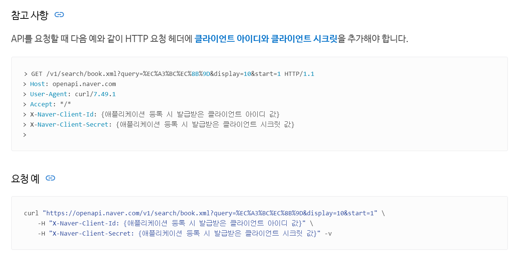

## API 키 발급 & 개발가이드 파악


## Kakao API 키 발급

https://developers.kakao.com/ 에 방문합니다. "내 애플리케이션" 메뉴를 클릭합니다.


<br/>


`+ 애플리케이션 추가하기` 버튼을 클릭합니다.


<br/>


앱 이름, 회사명, 카테고리를 입력해줍니다. 그리고 저장합니다.


<br/>


애플리케이션이 추가된 모습입니다.


<br/>


앱 키를 확인해보러 갑니다.


<br/>


REST API 키를 복사해주시면 됩니다.


<br/>


## Naver API 키 발급

https://developers.naver.com/main/ 에 방문해서 Appliation → 애플리케이션 등록 버튼을 클릭합니다.


<br/>


애플리케이션을 등록하면서 아래와 같이 선택해줍니다.


사용 API

- "검색" 을 선택했습니다.

<br/>


Client ID, Client Secret 키를 복사해두시면 됩니다.


<br/>


## Kakao API > 도서 검색 기능

제품 버튼을 클릭합니다.


<br/>


아래로 스크롤 하면 검색버튼이 나타나는데 이 버튼을 클릭해줍니다.


<br/>


문서보기 버튼을 클릭합니다.


<br/>


나타나는 화면에서 `REST API` 버튼을 클릭합니다.


<br/>


### Kakao API 의 API KEY 헤더 형식

Kakao API 에서 사용할 수 있는 API key 의 헤더 형식에 대해 나오는데, 이 방식대로 요청하면 요청이 이뤄지게 됩니다. 요청 형식을 코드에 복사해두거나 별도의 텍스트 파일에 복사해둡니다.


<br/>


## Naver API > 도서 검색 기능

https://developers.naver.com/main/ 에 접속해서 Products 메뉴에 마우스를 올려두면 서브 메뉴가 나타나는데 이 중 `검색` 을 선택합니다.


<br/>


`개발 가이드 보기` 버튼을 클릭합니다.


<br/>


왼쪽 사이드 메뉴에서 "책"을 선택합니다.


<br/>


### Naver API 의 API Key 요청 형식

아래로 스크롤을 하면 아래와 같은 내용이 나옵니다.

> [참고사항](https://developers.naver.com/docs/serviceapi/search/book/book.md#%EC%B0%B8%EA%B3%A0-%EC%82%AC%ED%95%AD)




<br/>


API를 요청할 때 다음 예와 같이 HTTP 요청 헤더에 [클라이언트 아이디와 클라이언트 시크릿](https://developers.naver.com/docs/common/openapiguide/appregister.md#클라이언트-아이디와-클라이언트-시크릿-확인)을 추가해야 합니다.

```sh
> GET /v1/search/book.xml?query=%EC%A3%BC%EC%8B%9D&display=10&start=1 HTTP/1.1
> Host: openapi.naver.com
> User-Agent: curl/7.49.1
> Accept: */*
> X-Naver-Client-Id: {애플리케이션 등록 시 발급받은 클라이언트 아이디 값}
> X-Naver-Client-Secret: {애플리케이션 등록 시 발급받은 클라이언트 시크릿 값}
>
```

#### 요청 예 

```sh
curl "https://openapi.naver.com/v1/search/book.xml?query=%EC%A3%BC%EC%8B%9D&display=10&start=1" \
    -H "X-Naver-Client-Id: {애플리케이션 등록 시 발급받은 클라이언트 아이디 값}" \
    -H "X-Naver-Client-Secret: {애플리케이션 등록 시 발급받은 클라이언트 시크릿 값}" -v
```

<br/>


