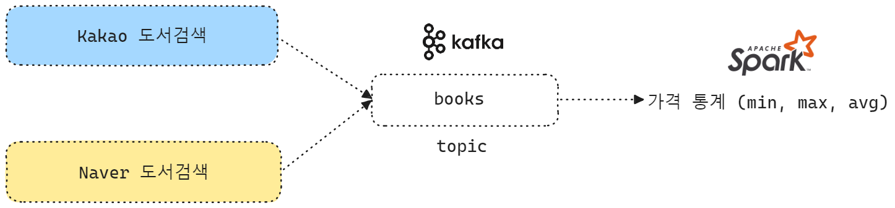

 

## 생산자

아래의 두 종류의 API 를 통해서 가져온 도서검색 결과를 Kafka 의 `books` 라는 토픽에 생산합니다.

- [Kakao 검색 API 내의 도서검색 기능](https://developers.kakao.com/docs/latest/ko/daum-search/dev-guide#search-book)
- [Naver 검색 API 내의 도서검색 기능](https://developers.naver.com/docs/serviceapi/search/book/book.md#%EA%B0%9C%EC%9A%94)

 

## 소비자

소비자에서는 가져온 도서 검색결과를 통해서 최고가, 최저가 등의 통계연산을 수행합니다.

